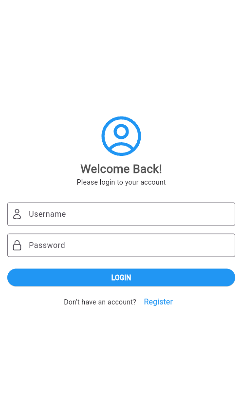
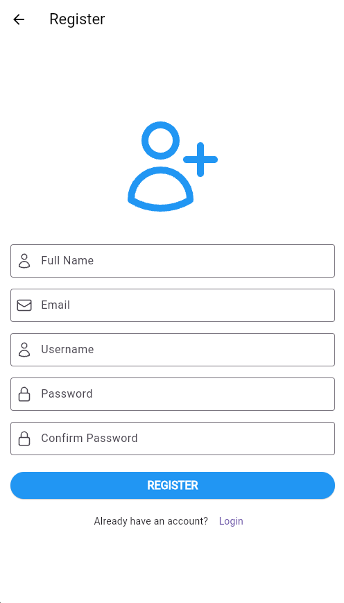
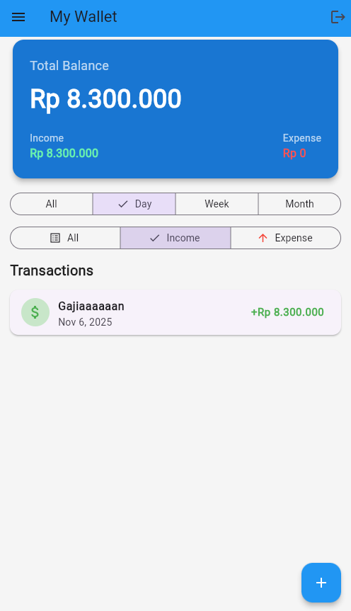
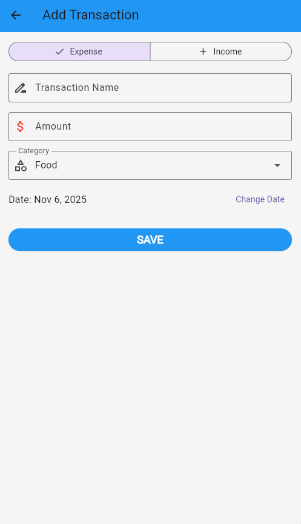

## 📝 Penjelasan Proyek
-----
**Expense Manager App** adalah aplikasi manajer keuangan (expense tracker) minimalis yang dibangun menggunakan Flutter. Aplikasi ini dirancang untuk bekerja sepenuhnya **offline-first**, memungkinkan pengguna untuk mendaftar, login, dan melacak pendapatan serta pengeluaran mereka langsung di perangkat.

Semua data—baik data autentikasi pengguna maupun data transaksi—disimpan secara lokal di penyimpanan perangkat menggunakan package `shared_preferences`.

-----

## ✨ Fitur Utama

  * 🔐 **Autentikasi Lokal:** Proses register dan login yang aman dengan data tersimpan di `shared_preferences`.
  * 📊 **Dashboard Modern:** Tampilan saldo total (all-time), serta ringkasan pemasukan & pengeluaran berdasarkan filter yang dipilih.
  * 🔄 **CRUD Penuh:** Fungsionalitas **C**reate, **R**ead, **U**pdate, & **D**elete untuk semua transaksi.
  * 🔍 **Filter Canggih:** Filter transaksi berdasarkan **Tipe** (Semua, Pemasukan, Pengeluaran) dan **Waktu** (Hari Ini, Minggu Ini, Bulan Ini, Semua).
  * 🔁 **Tarik untuk Refresh:** Muat ulang data transaksi dengan mudah di halaman utama.
  * 📱 **Desain Minimalis:** UI yang bersih dan modern menggunakan prinsip-prinsip Material 3.
  * 🇮🇩 **Format Rupiah:** Semua nilai mata uang diformat dengan benar ke `Rp` menggunakan package `intl`.

-----

## 📸 Preview Aplikasi

| Nama Halaman | Preview Aplikasi |
| :--- | :--- |
| **Login** |  |
| **Register** |  |
| **Daftar Transaksi & Filter** |  |
| **Formulir Tambah/Edit** |  |
